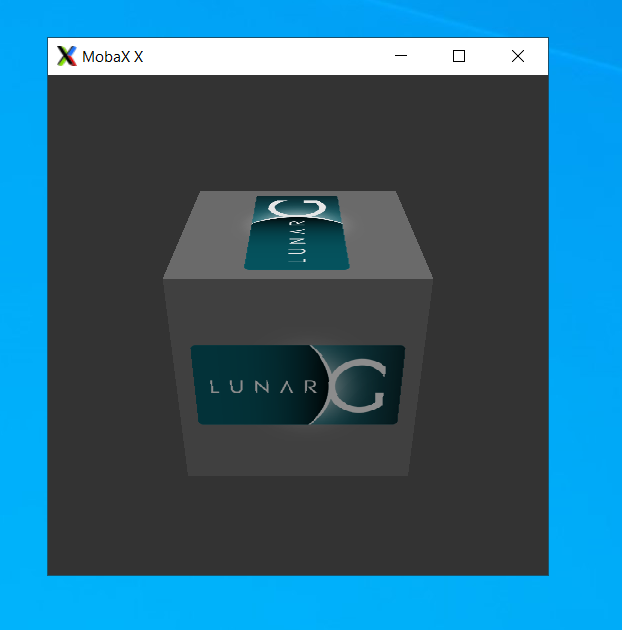

# Vulkan

## Introduction
This project includes Dockerfiles for building a Vulkan SDK container that can be used with NVIDIA GPUs. 

### Pre-Requisites

Before getting started, ensure that the system has the latest 
[NVIDIA driver](https://docs.nvidia.com/datacenter/tesla/tesla-installation-notes/index.html) and 
the [NVIDIA Container Toolkit](https://github.com/NVIDIA/nvidia-docker) installed.

## Build

Clone the git repository and then build the image:

```bash
docker build --pull -t \
   nvidia/vulkan:1.3-470 \
   --build-arg BASE_DIST=ubuntu20.04 \
   --build-arg CUDA_VERSION=11.4.2 \
   --build-arg VULKAN_SDK_VERSION=`curl -sk https://vulkan.lunarg.com/sdk/latest/linux.txt` \
   --file docker/Dockerfile.ubuntu .
``` 

## Usage

The Vulkan SDK container is typically intended to be used as the base-layer for other Vulkan applications. 
To see an example, refer to the `samples/` directory, which showcases how the image can be used in multi-stage 
Docker builds. 

The Vulkan SDK container however includes utilities such as `vulkaninfo`, which can be used to test whether 
the GPUs can be enumerated by the Vulkan loader and driver. 

As a first step, launch the container and open a terminal. 

> **_NOTE:_**  Some of the loaders need to be currently specified on the command line with Docker 
as bind mounts. This issue will be fixed in a future release of the NVIDIA Container Toolkit. 

### Headless `vulkaninfo`

A common utility to test Vulkan is to run `vulkaninfo`. In this example, we run `vulkaninfo` without 
specifying any `DISPLAY` variables:

```bash
docker run --gpus all \
   -e NVIDIA_DISABLE_REQUIRE=1 \
   -e NVIDIA_DRIVER_CAPABILITIES=all --device /dev/dri \
   -v /etc/vulkan/icd.d/nvidia_icd.json:/etc/vulkan/icd.d/nvidia_icd.json \
   -v /etc/vulkan/implicit_layer.d/nvidia_layers.json:/etc/vulkan/implicit_layer.d/nvidia_layers.json \
   -v /usr/share/glvnd/egl_vendor.d/10_nvidia.json:/usr/share/glvnd/egl_vendor.d/10_nvidia.json \
   -it nvidia/vulkan:1.3-470 \
    bash
```
Once inside the container, run `vulkaninfo`: 

```console
root@075caf680108:/# vulkaninfo
```

You should see an output such as below, which shows the version, enumerated GPUs and supported 
NVIDIA extensions.

```console
==========
VULKANINFO
==========

Vulkan Instance Version: 1.3.204

...

VK_LAYER_NV_optimus (NVIDIA Optimus layer) Vulkan version 1.2.175, layer version 1:
        Layer Extensions: count = 0
        Devices: count = 1
                GPU id = 0 (Tesla T4)
                Layer-Device Extensions: count = 0
...

Device Properties and Extensions:
=================================
GPU0:
VkPhysicalDeviceProperties:
---------------------------
        apiVersion     = 4202671 (1.2.175)
        driverVersion  = 1972256896 (0x758e4080)
        vendorID       = 0x10de
        deviceID       = 0x1eb8
        deviceType     = PHYSICAL_DEVICE_TYPE_DISCRETE_GPU
        deviceName     = Tesla T4

...

        VK_NV_inherited_viewport_scissor          : extension revision 1
        VK_NV_mesh_shader                         : extension revision 1
        VK_NV_ray_tracing                         : extension revision 3
        VK_NV_representative_fragment_test        : extension revision 2
        VK_NV_sample_mask_override_coverage       : extension revision 1
        VK_NV_scissor_exclusive                   : extension revision 1
        VK_NV_shader_image_footprint              : extension revision 2
        VK_NV_shader_sm_builtins                  : extension revision 1
        VK_NV_shader_subgroup_partitioned         : extension revision 1
        VK_NV_shading_rate_image                  : extension revision 3
        VK_NV_viewport_array2                     : extension revision 1
        VK_NV_viewport_swizzle                    : extension revision 1


```

### vkcube

Another graphical utility to test the Vulkan setup is to run the `vkcube` application. This utility spins 
up a window on the client side, so a pre-requisite is to ensure that there is an X server running on the client 
side. 

First, allow users to access the X server:

```bash
$ xhost +
```

Then, specify the `DISPLAY` environment variable before starting the container:

```bash
docker run --gpus all \
   -e NVIDIA_DISABLE_REQUIRE=1 \
   -v $HOME/.Xauthority:/root/.Xauthority \
   -e DISPLAY -e NVIDIA_DRIVER_CAPABILITIES=all --device /dev/dri --net host \
   -v /etc/vulkan/icd.d/nvidia_icd.json:/etc/vulkan/icd.d/nvidia_icd.json \
   -v /etc/vulkan/implicit_layer.d/nvidia_layers.json:/etc/vulkan/implicit_layer.d/nvidia_layers.json \
   -v /usr/share/glvnd/egl_vendor.d/10_nvidia.json:/usr/share/glvnd/egl_vendor.d/10_nvidia.json \
   -it nvidia/vulkan:1.3-470 \ 
   bash
```

Once inside the container, run the `vkcube` utility:

```bash
root@075caf680108:/# vkcube
Selected GPU 0: Tesla T4, type: 2
```

And then on the client side, you should be able to observe a spinning cube in a window:



## Building and Running Samples

A sample container is provided to test headless Vulkan functionality - this is especially useful 
on NVIDIA GPUs without display (i.e. datacenter class products). Two samples are included - `computeheadless`, 
which computes Fibonacci series and a `renderheadless`, which renders an image and saves it to local storage. 

A sample container has already been pre-built to test the Vulkan functionality. Simply run as:

```bash
docker run --gpus all \
    dualvtable/vulkan-sample:latest
```

The container will run through the headless samples with an output shown below:

```console
Running headless compute example
GPU: Tesla T4
Compute input:
0       1       2       3       4       5       6       7       8       9       10      11      12      13      14      15      16      17        18      19      20      21      22      23      24      25      26      27      28      29      30      31
Compute output:
0       1       1       2       3       5       8       13      21      34      55      89      144     233     377     610     987     1597      2584    4181    6765    10946   17711   28657   46368   75025   121393  196418  317811  514229  832040  1346269
Finished. Press enter to terminate...\n

Running headless rendering example
GPU: Tesla T4
Framebuffer image saved to headless.ppm
Finished. Press enter to terminate...\n
```

### Building the sample

The sample may also be built by cloning the `Dockerfile` available in the `samples/` directory 
of the repository.

```bash
cd samples/ \ 
&& docker build --pull -t \
     nvidia/vulkan-sample \
     --build-arg VULKAN_SDK_VERSION=`curl -sk https://vulkan.lunarg.com/sdk/latest/linux.txt | awk '{ printf("%.2g", $1) }` \
     --build-arg DRIVER_VERSION=470 \
     --file Dockerfile.ubuntu .
```

## Versioning

The Vulkan SDK image is versioned as `<Vulkan-SDK>-<Driver-Branch>`.

## Licensing

The source code in this repository is licensed under [Apache 2.0](https://www.apache.org/licenses/LICENSE-2.0). 
The resulting container images are licensed under the [NGC Deep Learning Container License](https://developer.nvidia.com/ngc/nvidia-deep-learning-container-license). 

## Issues and Contributing

[Checkout the Contributing document!](CONTRIBUTING.md)

* Please let us know by [filing a new issue](https://gitlab.com/nvidia/container-images/vulkan/-/issues)
* You can contribute by opening a [pull request on the gitlab repository](https://gitlab.com/nvidia/container-images/vulkan)
